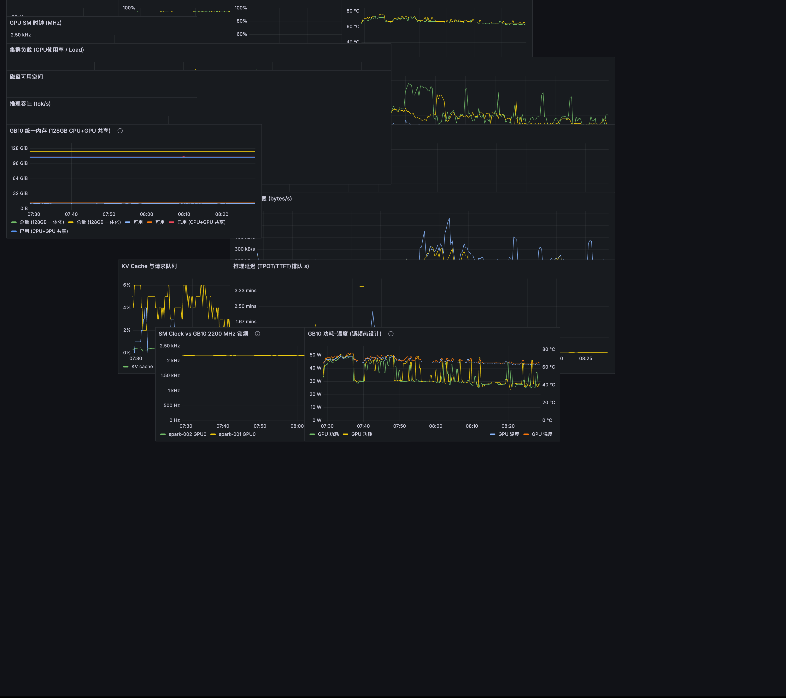
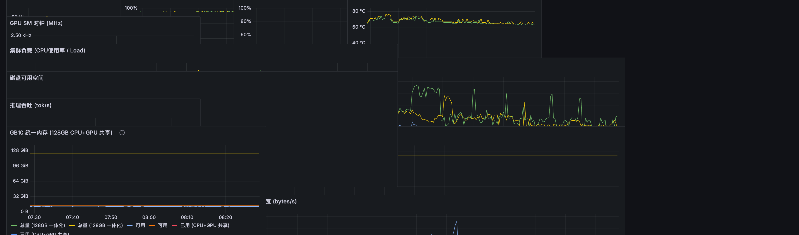
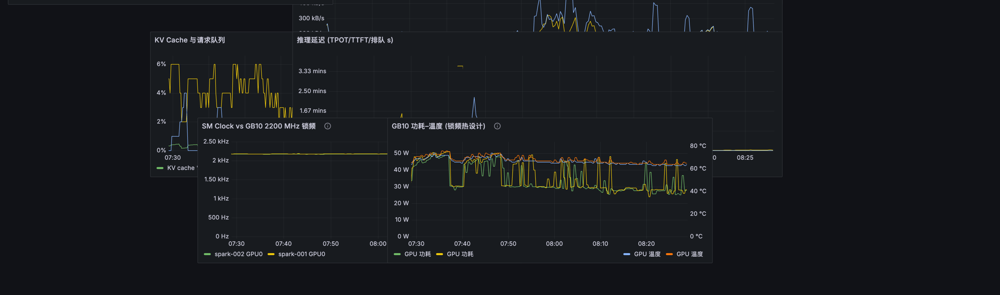

# DGX Spark Cluster Monitoring Stack

> **One-command monitoring for NVIDIA DGX Spark (GB10) clusters** — DCGM GPU metrics, node system metrics, and vLLM inference telemetry, all in a pre-built Grafana dashboard.

[](LICENSE)


Monitor your **NVIDIA DGX Spark / GB10** cluster in minutes with a ready-made **open-source Grafana dashboard**. No manual panel wiring — pull the stack, run one script, and get:

- 🎛️ **DCGM GPU telemetry** — power draw, utilization, memory/engine utilization, temperatures, SM clocks, cumulative energy
- 🖥️ **Node system metrics** — CPU temp & load, memory, disk, network bandwidth
- 🤖 **vLLM inference telemetry** — tokens/sec throughput, KV cache usage, request queue, TPOT/TTFT latency
- 🌐 **Multi-node ready** — monitor two (or more) GB10 nodes from one dashboard
- 🔒 **GB10-specific telemetry** — unified 128 GB CPU+GPU memory, the 2200 MHz clock cap thermal practice, and GB10 power–temperature co-plotting

---

## ✨ Why GB10-specific? (not just “runs on a GB10”)

A generic NVIDIA stack renders the same series on any x86 host. This dashboard is intentionally **specific to the GB10 Grace Blackwell superchip**:

- **128 GB unified memory, not VRAM + host RAM.** DGX Spark has one shared LPDDR5X pool (Grace CPU + Blackwell GPU). The *GB10 统一内存* panel watches that single pool directly — there is no separate frame-buffer dimension to list (GB10 does not even expose `DCGM_FI_DEV_FB_*`, verified on-device).
- **2200 MHz clock-cap thermal engineering.** GB10's recommended software clock cap (`nvidia-smi -i 0 -lgc 0,2200`, hardware max is 3003 MHz) is the single biggest lever for keeping a desktop supercomputer cool. The *SM Clock vs 2200 MHz 锁频* panel plots live clocks against both the cap and the silicon max, and *功耗–温度* co-plots power and temperature so the trade-off is visible in one view.
- **Two-node 200 Gb/s fabric serving.** Scaling to a second GB10 over the RoCE fabric and serving model weights with tensor parallelism are first-class DGX Spark workflows; the whole stack labels every node and every GPU so 1–N Spark maps cleanly onto one Prometheus.

**Full reproducible argument & on-device verification commands:**
[`docs/gb10-specific-panels.md`](docs/gb10-specific-panels.md)

---

### 📋 Community / Listing

- Accepted-review status: [bidual/awesome-dgx-spark #8](https://github.com/bidual/awesome-dgx-spark/pull/8) — pending maintainer review (open, mergeable).
- Repo topics: `dgx-spark` · `gb10` · `grafana-dashboard` · `dcgm` · `vllm` · `prometheus` · `multi-node`

---

## 🎯 Features

- **GPU temperature & thermal monitoring** — catch thermal throttling before it hurts inference (core + memory °C)
- **GPU utilization & power monitoring** — DCGM-powered utilization, power draw, and SM clocks in real time
- **LLM inference observability** — vLLM throughput (tok/s), KV cache usage, request queue, TPOT/TTFT latency
- **Full node health** — CPU load, memory & swap, disk free space, network bandwidth
- **Auto-imported dashboard** — 17 pre-built Grafana panels (14 generic + 3 GB10-specific), zero manual configuration
- **Multi-node cluster support** — monitor 1–N DGX Spark GB10 nodes from a single Prometheus + Grafana
- **One-command Docker install** — `./install.sh start` and you're live
- **No vendor lock-in** — standard Prometheus + Grafana + DCGM exporter + node_exporter

<p align="center">
  
  <br/><i>DGX Spark 集群监控 dashboard — 17 panels in one auto-imported Grafana view</i>
</p>

#### GB10-specific panels (close-up)

<p align="center">
  
  <br/><i>GB10 特有面板：统一内存 / 2200 MHz 锁频 / 功耗–温度联动（本图来自真实双机集群实采数据）</i>
</p>

#### General GPU / system / inference panels (close-up)

<p align="center">
  
  
  
  <br/><i>GPU 遥测 / 节点系统 / vLLM 推理 面板细节</i>
</p>

---

## ✨ Why DGX Spark Monitoring?

The DGX Spark (GB10) packs serious AI compute into a desktop. This stack answers the questions you actually ask:

- *Is my GPU thermal-throttling?* → **GPU temp & SM clock** panels
- *Is my vLLM server the bottleneck?* → **throughput, KV cache, latency** panels
- *Is the cluster healthy?* → **system load, memory, disk, network** panels

All shipped as a **pre-wired Grafana dashboard** (`DGX Spark 集群监控`) that auto-imports on first boot.

---

## 👀 Try the dashboard without any hardware (mock)

No DGX Spark yet? Spin up the full 17-panel dashboard with a **synthetic two-node GB10** in one command (all metrics clearly labelled `MOCK`, mimicking a 2200 MHz clock-capped pair):

```bash
docker compose -f docker-compose.mock.yml up -d
open http://localhost:3000          # admin / admin
```


---

## 🚀 Quick Start

**Prerequisites:** Docker + Docker Compose, NVIDIA Container Toolkit (for DCGM exporter), on each node you want to monitor.

```bash
# 1. Clone
git clone https://github.com/Jenpo/dgx-spark-monitoring.git
cd dgx-spark-monitoring

# 2. (Optional) Configure nodes
cp .env.example .env   # set SPARK_NODE1_HOST / SPARK_NODE2_HOST / VLLM_HOST

# 3. One-command install
./install.sh start

# 4. Open the dashboard
#    Grafana    http://localhost:3000   (admin / admin)
#    Prometheus http://localhost:9090
```

> ⚠️ On **node 2** (second DGX Spark), run only the exporters:
> ```bash
> docker run -d --runtime=nvidia --network=host --name dcgm-node2 nvidia/dcgm-exporter:3.3.5-1.4.0-ubuntu22.04
> docker run -d --network=host --pid=host --name node-exp2 prom/node-exporter:v1.8.1
> ```

That's it — the **"DGX Spark 集群监控"** dashboard auto-loads with 17 pre-built panels.

> 💡 Grafana 10 asks you to change the default `admin/admin` password on first login. To keep the stock credentials for headless/scripted use, add this to your Grafana service:
> `GF_SECURITY_DISABLE_INITIAL_ADMIN_PASSWORD_CHANGE=true`

---

## 📊 Dashboard Panels

| Metric | Panel(s) |
|---|---|
| GPU Power (W) | `DCGM_FI_DEV_POWER_USAGE` |
| GPU Utilization (%) | `DCGM_FI_DEV_GPU_UTIL` |
| Engine Util (MemCopy/Dec/Enc %) | `DCGM_FI_DEV_MEM_COPY_UTIL` / `_DEC_` / `_ENC_` |
| GPU Temp (core/mem °C) | `DCGM_FI_DEV_GPU_TEMP` / `_MEMORY_TEMP` |
| SM Clock (MHz) | `DCGM_FI_DEV_SM_CLOCK` |
| Cumulative Energy (mWh) | `DCGM_FI_DEV_TOTAL_ENERGY_CONSUMPTION` |
| CPU Temp (max/avg °C) | `node_thermal_zone_temp` |
| Load & CPU% | `node_load1/5/15` |
| Memory / Swap | `node_memory_*` |
| Disk Free | `node_filesystem_avail_bytes` |
| Network BW (B/s) | `node_network_*` |
| Inference t/s | `vllm:*_tokens_total` |
| KV Cache & Queue | `vllm:kv_cache_usage_perc` / `num_requests_*` |
| Latency (TPOT/TTFT/queue) | `vllm:inter_token_latency` / `request_prefill` / `request_queue` |
| **GB10 统一内存 (128GB CPU+GPU 共享)** | `node_memory_MemTotal/Available` — 一体池语义，无独立 FB |
| **SM Clock vs GB10 2200 MHz 锁频** | `DCGM_FI_DEV_SM_CLOCK` + 2200 cap / 3003 max 参考线 |
| **GB10 功耗–温度 (锁频热设计)** | `DCGM_FI_DEV_POWER_USAGE` × `DCGM_FI_DEV_GPU_TEMP` 双轴 |

---

## 🔧 Configuration

All knobs live in **`.env`** (copy from `.env.example`):

| Variable | Default | Description |
|---|---|---|
| `SPARK_NODE1_HOST` | `127.0.0.1` | Main node / this host |
| `SPARK_NODE2_HOST` | *(empty)* | Second DGX Spark (blank = single node) |
| `VLLM_HOST` | *(empty)* | vLLM server (blank = no inference metrics) |
| `PROM_RETENTION` | `30d` | Prometheus data retention |
| `GRAFANA_ADMIN_USER` / `PASSWORD` | `admin` / `admin` | Grafana login |

---

## 📁 Project Structure

```
dgx-spark-monitoring/
├── docker-compose.yml                 # One-command stack
├── install.sh                         # Start / stop / status / logs
├── .env.example                       # Node & auth configuration
├── prometheus/
│   └── prometheus.yml                 # Scrape template (rendered at install)
├── grafana/
│   └── provisioning/                  # Auto datasource + dashboard import
│       ├── datasources/datasource.yml
│       └── dashboards/dgx-spark-cluster.json   # 17-panel dashboard (14 generic + 3 GB10-specific)
├── exporters/                         # Manual exporter setup for node 2
└── donate/                            # WeChat & Alipay donation QR codes
```

---

## 💚 Support & Donate

If this saves you time, a coffee is appreciated:

<p align="center">
  
  
</p>

<p align="center">
  <b>WeChat Pay (微信)</b> &nbsp;·&nbsp; <b>Alipay (支付宝)</b>
</p>

> ⚠️ The bundled QR codes are **placeholders**. Replace `donate/wechat-qr.jpg` and `donate/alipay-qr.jpg` with your own payment codes.

---

## 📖 Documentation (多语言)

- [中文说明](README.zh-CN.md)
- English (this file)

---

## ❓ FAQ

**How do I monitor NVIDIA DGX Spark (GB10)?**
Run the one-command Docker stack. It starts a DCGM exporter, node_exporter, Prometheus, and Grafana with a pre-built 17-panel dashboard. See [Quick Start](#-quick-start).

**How do I check DGX Spark GPU temperature?**
Open the dashboard and look at the **GPU 温度 (核心/显存 °C)** panel, powered by `DCGM_FI_DEV_GPU_TEMP` and `DCGM_FI_DEV_MEMORY_TEMP` metrics from the DCGM exporter.

**How do I monitor vLLM inference metrics (throughput, latency)?**
Set `VLLM_HOST` in `.env` and expose your vLLM Prometheus metrics port (default `8888`). The dashboard shows tokens/sec, KV cache usage, request queue, and TPOT/TTFT latency panels.

**Which metrics does the dashboard show?**
GPU power, utilization, engine (memcopy/decode/encode) utilization, core & memory temperature, SM clocks, cumulative energy — plus node CPU/memory/disk/network, and vLLM inference metrics. See [Dashboard Panels](#-dashboard-panels).

**Can I monitor multiple DGX Spark nodes?**
Yes. Set `SPARK_NODE2_HOST` (and more) in `.env`; the stack labels each node (`spark-001`, `spark-002`, …) so all GPUs appear in one dashboard.

**Is this a fork of NVIDIA's official monitoring?**
No. It's an independent open-source stack built on the standard DCGM exporter, node_exporter, Prometheus, and Grafana. Not affiliated with or endorsed by NVIDIA.

**What is the default Grafana login?**
`admin` / `admin`, changeable via `GRAFANA_ADMIN_USER` / `GRAFANA_ADMIN_PASSWORD` in `.env`.

---

## 🗺️ Roadmap

- [x] DGCM GPU telemetry dashboard
- [x] Multi-node (2× GB10) support
- [x] vLLM inference metrics
- [ ] Grafana alerting rules (thermal / OOM / disk)
- [ ] Kubernetes / Slurm job monitoring

---

## 📄 License

[MIT](LICENSE) © 2026 [Jenpo]

---

*Built for the NVIDIA DGX Spark (GB10) cluster. NVIDIA, DGX, and GB10 are trademarks of NVIDIA Corporation. This project is not affiliated with or endorsed by NVIDIA.*
